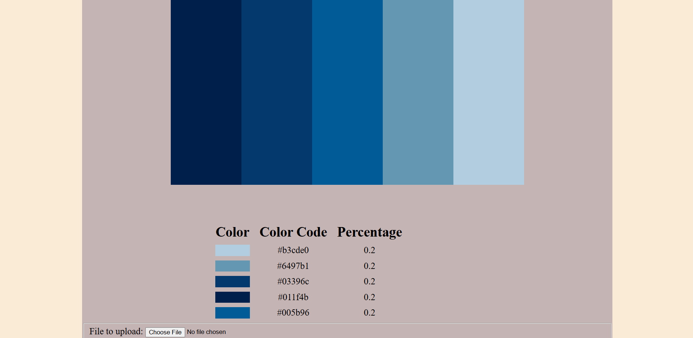

# Color Detector

A Flask-based web application that analyzes images and extracts the most used colors. 
Users can upload any image and specify how many colors they wish to detect.

## Features

- **Image Upload**: Upload images directly through the web interface
- **Customizable Analysis**: Choose the number of colors to detect
- **Exact Color Extraction**: Uses NumPy to identify the most frequent colors in the image
- **Visual Results**: Display the uploaded image along with its color palette
- **Frequency Results**: Displays the frequency with which each color appears
- **Responsive Design**: Clean, user-friendly interface

## Technologies Used

- **Backend**: Flask (Python web framework)
- **Image Processing**: OpenCV (cv2) for image handling
- **Color Analysis**: NumPy for array operations color counting
- **Frontend**: HTML, CSS, Jinja2 templating
- **File Handling**: Werkzeug utilities for secure file uploads

## Example Output


## How It Works

1. User uploads an image and specifies the number of colors to detect
2. The application reads all pixels in the image using OpenCV
3. NumPy identifies all unique colors and counts their frequency
4. The application selects the user designated N colors
5. Results are displayed showing the original image, its color palette, hex values, and frequency

## Installation

### Prerequisites
- Python 3.7+
- pip package manager

### Setup

1. Clone the repository:
```bash
git clone https://github.com/JustinWoo20/color-detector.git
cd color-detector
```

2. Create a virtual environment (recommended):
```bash
python -m venv venv
source venv/bin/activate  # On Windows: venv\Scripts\activate
```

3. Install dependencies:
```bash
pip install -r requirements.txt
```

4. Run the application:
```bash
python server.py
```

## Usage

1. Click "Choose File" and select an image from your computer
2. Enter the number of colors you want to detect (e.g., 5)
3. Click 'Detect Colors'
4. View your results

## Project Structure
```
color-detector/
│
├── server.py              # Flask application and routes
├── detector.py            # Color detection logic
├── requirements.txt       # Python dependencies
│
├── static/
│   ├── styles.css        # CSS styling
│   └── img/              # Sample images
│
└── templates/
    ├── index.html        # Home page with upload form
    └── detected.html     # Results page
```

## Example Use Cases

- **Design**: Extract color palettes from inspiration images for design projects
- **Photography**: Analyze the colors in photographs
- **Branding**: Identify color schemes from logos or brand imagery
- **Art**: Explore the color composition of artwork

## Future Enhancements

- [ ] Add color name identification (e.g., "Sky Blue", "Forest Green")
- [ ] Export color palette in a downloadable format (PNG, JSON)
- [ ] Batch processing for multiple images

## Contributing

Contributions are welcome! Please feel free to submit a Pull Request.

## License

MIT License – free to use, modify, and distribute.

## Contact

Justin Woodard - justinw86420@gmail.com

Project Link: https://github.com/JustinWoo20/color-detector